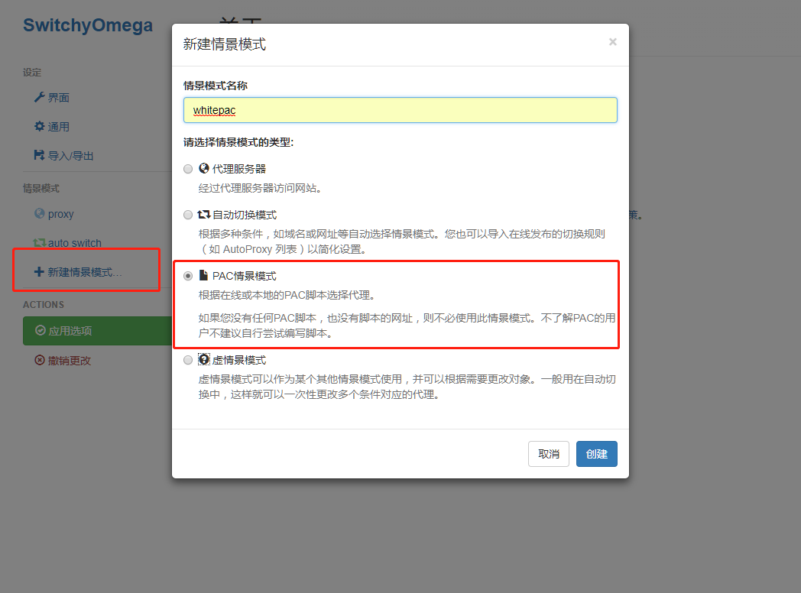
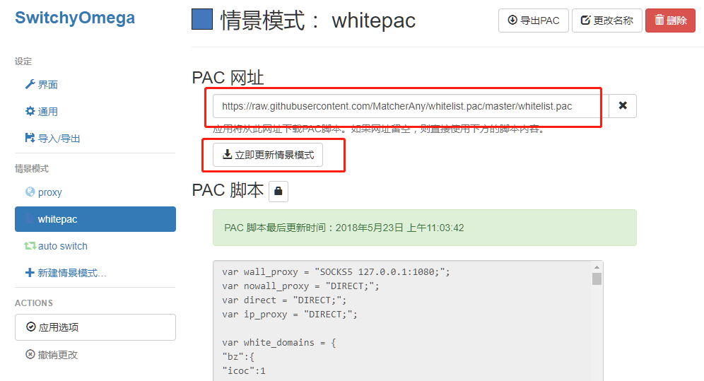
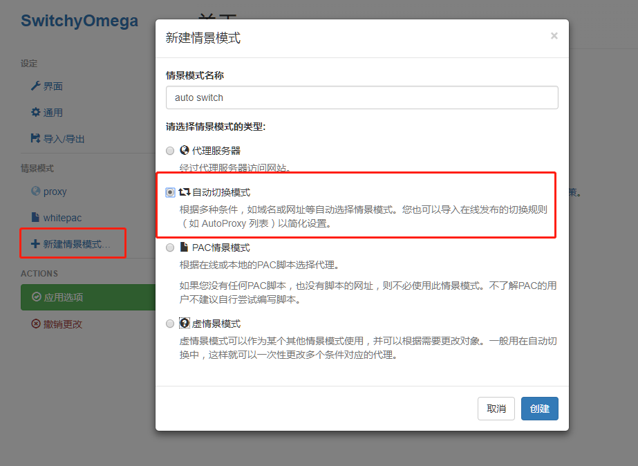
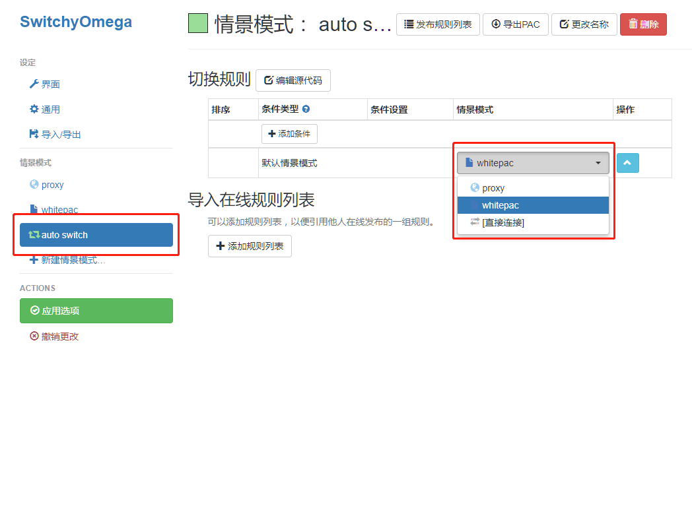
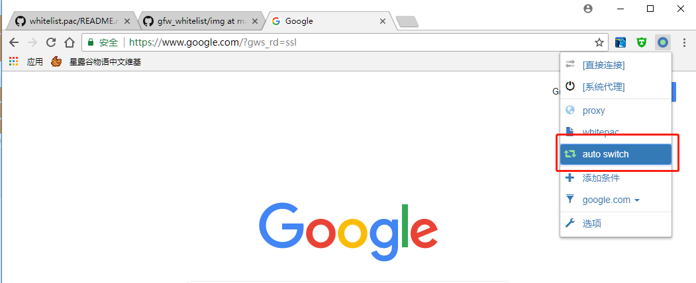

# 概述
原作者是[破娃酱](https://github.com/breakwa11)，这个是自己使用并维护的白名单pac文件，不定时更新常见域名
详细使用方法可以查看 https://github.com/breakwa11/gfw_whitelist

在线PAC地址:https://api.icyuyan.net/pac/whitelist.pac

# 代理设置教程

## 1. 安装浏览器插件

google chrome:https://chrome.google.com/webstore/detail/proxy-switchyomega/padekgcemlokbadohgkifijomclgjgif 

microsoft new Edge: https://microsoftedge.microsoft.com/addons/detail/proxy-switchyomega/fdbloeknjpnloaggplaobopplkdhnikc 

其他浏览器或者类chromiumn浏览器: https://github.com/FelisCatus/SwitchyOmega/releases

## 2. 创建情景模式

在线PAC地址:https://api.icyuyan.net/pac/whitelist.pac

## 3. 选择auto white情景模式
